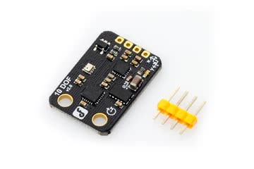

# DFRobot SEN0140 ROS2
This is a ROS2 package for the DFRobot SEN0140 10 DOF Mems IMU Sensor. More info about the sensor can be found on the [DFRobot wiki](https://wiki.dfrobot.com/sen0140/) or in the [datasheets](datasheets/).



## Usage
1. Clone the repo into the `src` directory of your ROS workspace:
```
cd ~/ros2_ws/src
git clone https://github.com/thelollipopman/sen0140_ros2.git
```

2. Build the package from your ROS workspace:
```
cd ~/ros2_ws
colcon build --symlink-install --packages-select sen0140_ros2
```

3. Source the setup script from your ROS workspace in a new terminal:
```
cd ~/ros2_ws
source install/setup.bash
```

3. Change the default parameters in the [`config.yaml`](config/config.yaml) as desired. See [Configure] for more info

4. Launch the ROS node:
```
ros2 launch sen0140_ros2 sen0140.launch.py config:=config.yaml
```
The `config` parameter accepts relative files paths from the `config` directory or absolute file paths.


## ROS2 topics


## Configure
Before running the package, ensure the ROS2 parameters are set correctly in [config.yaml](config/config.yaml) (or a custom `.yaml` config file). This package

```

```

The default sensor I2C addresses (`address`) should be correct, but can be checked with an I2C scan and changed if needed. All the sensors expose an output data rate parameter directly or indirectly. This can be set using the `rate` parameter. 

### ADXL345 Accelerometer + ITG3200 Gyroscope

#### ADXL345 Accelerometer 
`output_data_rate`: The accelerometer output data rate is directly exposed in fixed frequencies (Hz): 6.25, 12.5, 25, 50, 100, 200, 400, 800, 1600, 3200.

`range`: 4 range settings are exposed, which can be set through `range` parameter:
| range param | range (g) |
| ----------- | --------- |
|      0      |     ±2    |
|      1      |     ±4    |
|      2      |     ±8    |
|      3      |    ±16    |

#### ITG3200 Gyroscope
`dlpfg_cfg`: The gyroscope uses a digital low pass filter and exposes a parameter `DLPFG_CFG` which gives appropriate combinations of low pass filter bandwidth and internal sample rate. If a very high data output data rate is required, choose DLPF_CFG = 0 for the highest internal sampling rate.

| dlpf_cg param | Low Pass Filter Bandwidth (Hz)| Internal Sample Rate (kHz) |
| ------------- | ----------------------------- | -------------------------- |
|       0       |              256              |             8              |
|       1       |              188              |             1              |
|       2       |               98              |             1              |
|       3       |               42              |             1              |
|       4       |               20              |             1              |
|       5       |               10              |             1              |
|       6       |                5              |             1              |

`rate`: The gyroscope output data rate is controlled using a sample rate divider, which accepts 0 to 255. So just ensure that `rate` and `dlpf_cfg` are chosen such that
$$
\text{sample rate divider} = \frac{\text{internal sample rate}}{\text{output data rate}} - 1 \\
0 \leq \text{sample rate divider} \leq 255
$$

Note that this gyro has range ±2000 degrees per second

### VCM5883L Magnetometer
`output_data_rate`: directly exposed in fixed frequencies (Hz): 10, 50, 100, 200


### BMP280 barometer
`oversampling_setting`: the datasheet has recommended combinations of pressure and temperature oversampling parameters which control the number of samples used in oversampling, which in turn determine the tradeoff between resolution and output data rate. 

| oversampling_setting param | Description | Pressure oversampling | Typical pressure resolution | Temperature oversampling | Typical temperature resolution |
| -------------------------- | --------------------- | --------------------- | --------------------------- | ------------------------ | ------------------------------ |
| 0 | ultra_low_power       | x1  | 16 bit / 2.62 Pa | x1 | 16 bit / 0.0050 °C | 
| 1 | low_power             | x2  | 17 bit / 1.31 Pa | x1 | 16 bit / 0.0050 °C |
| 2 | standard_resolution   | x4  | 18 bit / 0.66 Pa | x1 | 16 bit / 0.0050 °C |
| 3 | high_resolution       | x8  | 19 bit / 0.33 Pa | x1 | 16 bit / 0.0050 °C |
| 4 | ultra_high_resolution | x16 | 20 bit / 0.16 Pa | x2 | 17 bit / 0.0025 °C |

The sensor does not expose output data rate directly. Instead, it directly depends on the oversampling setting chosen (greater oversampling size takes more time and hence has slower output) as well as standby time, which this library already sets to the minimum to guarantee the highest possible output data rate.